  

  

<h3 align="center">
  
  Information Technology Student | Aspiring Full-Stack Developer
</h3>

  
  
  
  

  <h3 align="left">
    About Me
    

    
- I am currently a final year Information Technology Diploma student! 
- I am interested in Full-Stack Development, Machine Learning, Cloud Computing & IoT
- Outside of coding, I really enjoy music, gaming and hiking

  <h3 align="left">
    My Recently Played Songs
    
  </h3>

---

## GitHub Activity

  

  
  &nbsp;&nbsp;
  

---
## Programming Languages

  
  &nbsp;
  

## Frameworks & Libraries

  
  &nbsp;
  
  
  

## Databases

  
  &nbsp;
  
  

## Cloud & IoT

  
  &nbsp;
  
  
  
  

## Developer & Design Tools

  

